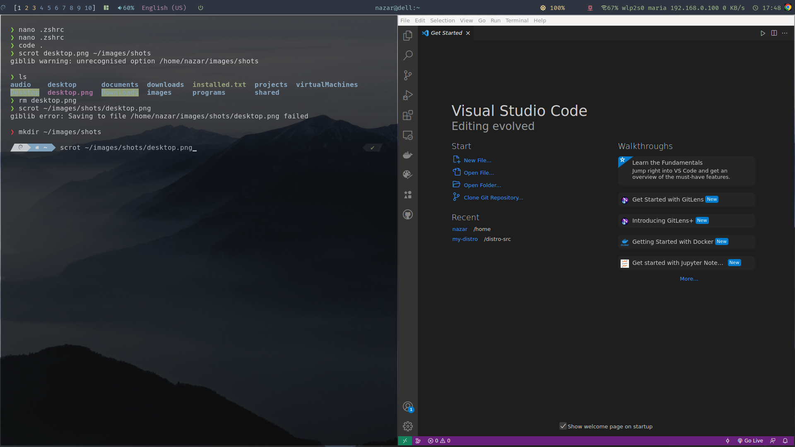

# <center>NazDE (Desktop Environment)</center>
My desktop environment based on Debian 11, inspired by [Chris Titus Tech](https://github.com/ChrisTitusTech/Debian-titus) repo
 
### Download Debian installer
Use the following Debian ISO as the base <https://cdimage.debian.org/debian-cd/current/amd64/bt-dvd/debian-11.5.0-amd64-DVD-1.iso.torrent/>

### Core packages
* [**pulseaudio**](https://www.freedesktop.org/wiki/Software/PulseAudio/) - _a sound server system for POSIX OSes_
* [**rofi**](https://github.com/davatorium/rofi) - _a window switcher, application launcher and dmenu replacement_
* [**ncpamixer**](https://github.com/fulhax/ncpamixer) -  _mixer for PulseAudio in console_
* [**feh**](https://feh.finalrewind.org/) - a lightweight _and powerful image viewer that can also be used to manage the desktop wallpaper_
* [**psmisc**](https://packages.debian.org/en/sid/psmisc) - _utilities that use the proc file system (**fuser**, **killall**, **peekfd**, **pstree**, **prtstat**)_
* [**picom**](https://github.com/yshui/picom) - _a compositor for X, it add transparency_
* [**sxhkd**](https://github.com/baskerville/sxhkd) - _is an X daemon that reacts to input events by executing commands (hotkey manager)_
* [**sddm**](https://github.com/sddm/sddm) - a modern _display manager for X11 and Wayland_
* [**polybar**](https://github.com/polybar/polybar) - _a fast and easy-to-use tool for creating status bars_
* [**bspwm**](https://github.com/baskerville/bspwm) - _a tiling window manager that represents windows as the leaves of a full binary tree_
* **zip, unzip** - _for archive processing_
* [**kitty**](https://sw.kovidgoyal.net/kitty) - _the fast, feature-rich, GPU based terminal emulator_
* [**zsh**](https://zsh.sourceforge.io/) - _a shell designed for interactive use_
* [**scrot**](https://github.com/resurrecting-open-source-projects/scrot) - _command line screen capture utility_
* [**dunst**](https://dunst-project.org/) - _a lightweight replacement for the notification daemons provided by most desktop environments_
* [**network-manager**](https://networkmanager.dev/) - _network configuration tool suite_
* [**xscreensaver**](https://www.jwz.org/xscreensaver/) - _the standard screen saver_
* [**acpid**](https://packages.debian.org/en/sid/acpid) - _a completely flexible, totally extensible daemon for delivering ACPI events(Fn-keys, etc)_
* [**playerctl**](https://man.archlinux.org/man/community/playerctl/playerctl.1.en) - _control media players via MPRIS_(used in Fn keys scripts)
* [**amixer**](https://linux.die.net/man/1/amixer) - _command-line mixer for ALSA soundcard driver_(used in Fn keys scripts)
* [**htop**](https://htop.dev/) - _a cross-platform interactive process viewer_

### Tools
* [**tree**](https://packages.debian.org/en/bullseye/tree) - _displays an indented directory tree, in color_
* [**net-tools**](https://packages.debian.org/en/bullseye/net-tools) - _includes the important tools for controlling the network subsystem of the Linux kernel_

### Fonts
* Fontawesome 4 Free
* Fontawesome 5 Free
* Fontawesome 6 Free
* [Powerline fonts](https://github.com/powerline/fonts)
* [Nerd Fonts](https://github.com/ryanoasis/nerd-fonts/releases/)
* emoji font
* ttf MS core fonts
* polybar custom font(<https://fontello.com/>)

### Apps
* **Google Chrome**
* **Firefox**
* **Docker**
* **Github CLI**
* **nvm (Node Js)**
* **Rust**
* **Dbeaver**
* **VS Code**
* **Intellij IDEA**
* **Anydesk**
* **Signal**
* **Libre Office**
* **FoxitReader**
* **Filezilla**
* **Transmission**
* **Gimp**
* **Kcalc**
* **Audacity**
* **Vlc**
* **Gucharmap**
* **gThumb**
* **OBS Studio**
### Themes
* [oh-my-zsh](https://ohmyz.sh/)
* [powerlevel10k](https://github.com/romkatv/powerlevel10k).
* [ls colors](https://github.com/trapd00r/LS_COLORS)

### ZSH plugins:
* [zsh-autosuggestions](https://github.com/zsh-users/zsh-autosuggestions)
* [web-search](https://github.com/ohmyzsh/ohmyzsh/tree/master/plugins/web-search)
* [json-tools](https://github.com/ohmyzsh/ohmyzsh/tree/master/plugins/jsontools)

## Install steps

1. Run as **root**, enter root login and password
```
apt install -y git \
&& mkdir /distro-src \
&& cd /distro-src \
&& git clone https://github.com/Nazark0/my-distro.git \
&& cd my-distro \
&& ./1.core-setup.sh
```
2. Login into system by your user account and run second script:
```
cd /distro-src/my-distro \
&& ./2.cofigs-setup.sh
```
3. Reboot your system.
4. When done, run last script as user:
```
./3.install-apps.sh
```
5. After that edit .zshrc file and add installed plugins:
```
plugins=(<...> zsh-autosuggestions web-search jsontools)
```
<center>
  
</center>

#### Extra Info
[**ACPI events**](https://linuxconfig.org/how-to-handle-acpi-events-on-linux)
[**x11-utils**](https://packages.debian.org/en/bullseye/x11-utils)